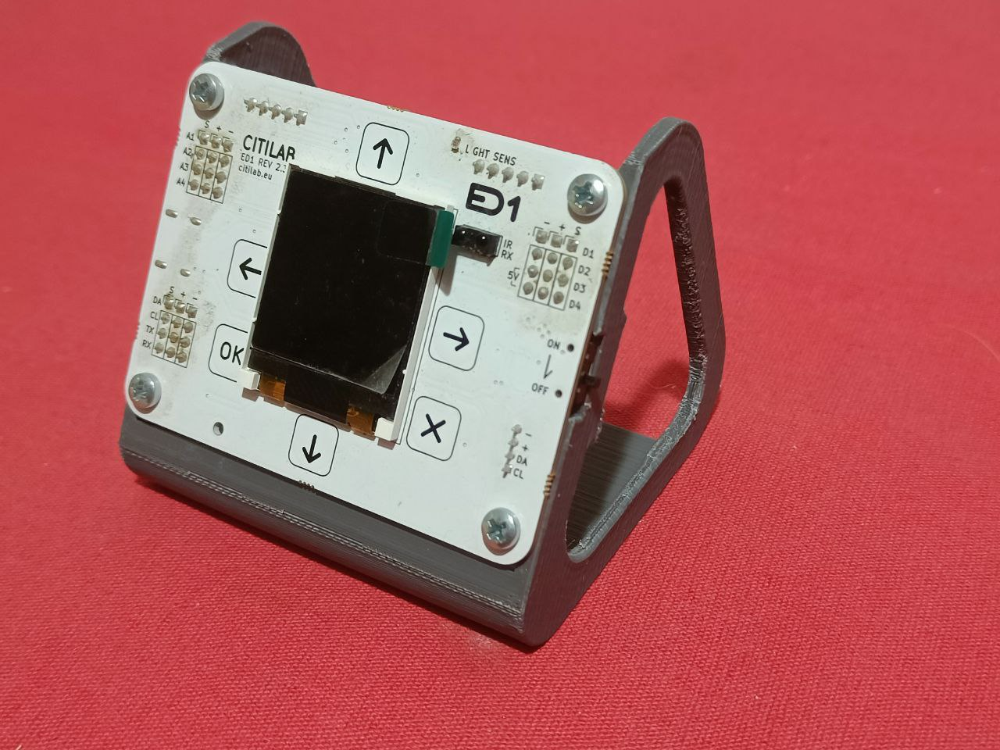

# Suport per la placa ED1 i una modificació per el robot Fantàstic

Aquest suport permet mantenir la placa ED1 en un angle de treball adequat per treballar 

La placa ED1 ha estat realitzada al [Citilab](https://www.citilab.eu/)    

  

Tota la [documentació es pot trobar en PDF](https://github.com/maynej/Suport-per-placa-ED1/tree/main/DOC). També en castellà.

STL per imprimir [aquí](https://github.com/maynej/Suport-per-placa-ED1/tree/main/STL).

## Suports 3D
  
Descripció         | Imatge          | Arxius STL         
------------- | ------------- | ------------- 
Suport placa ED1 | | [Suport](STL/ED1_SuportV2.stl)
Suport placa 8 Neopixel | | [Suport](STL/SuportNeopixel.stl)

## Robot Fantàstic i les peces 3D

  
Descripció         | Imatge          | Arxius STL         
------------- | ------------- | ------------- 
Base Fantàstic | | [Base](STL/BaseFantastic_x1.stl)
Roda | | [Roda](STL/Roda_x2.stl)
Lateral Dret | | [Lateral D](STL/LateralD_x1.STL)
Lateral Esquerra | | [Lateral E](STL/LateralE_x1.STL)

## Suport per Sensor d'ultrasons per detectar obstacles

  
Descripció         | Imatge          | Arxius STL         
------------- | ------------- | ------------- 
Suport 1 | | [Suport 1](STL/SuportSensorUltrasonsSimetric1.stl)
Suport 2 | | [Suport 2](STL/SuportSensorUltrasonsSimetric2.stl)

## Suport per Sensor de IR per fer el seguir línies 

  
Descripció         | Imatge          | Arxius STL         
------------- | ------------- | ------------- 
Suport IR | | [Suport IR](STL/SuportSensorIR_Torretes.stl)

## Suport per placa 8 Neopixel

  
Descripció         | Imatge          | Arxius STL         
------------- | ------------- | ------------- 
Suport placa 8 Neopixel | | [Suport](STL/SuportNeopixel.stl)

## Llicència
Creative Commons Attribution-NoComercial-ShareAlike 4.0 International (CC BY-NC-SA 4.0)  

## QR

 <a href="https://www.codigos-qr.com/en/qr-code-generator/" target="_blank" id"qrgenerator">Qr Code Generator</a>

